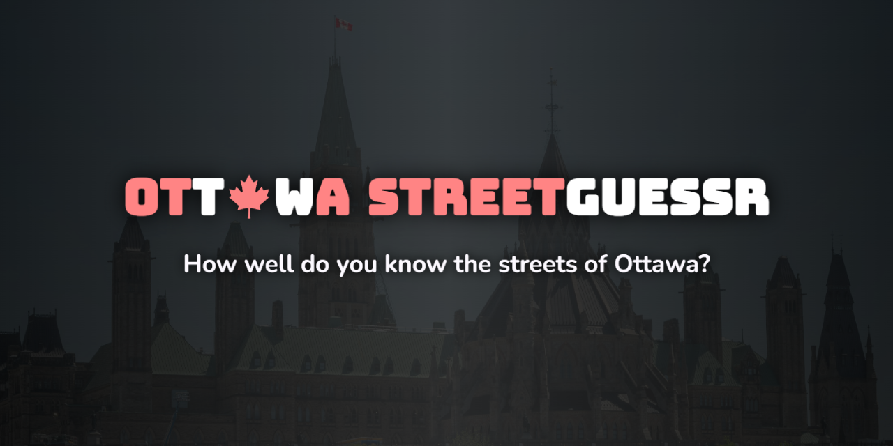

# Ottawa StreetGuessr

A web game inspired by GeoGuessr, where you have to locate a street based on a traffic camera's feed.

# Attribution
- Photo by <a href="https://unsplash.com/@aleks_g?utm_source=unsplash&utm_medium=referral&utm_content=creditCopyText">Aleksandr Galenko</a> on <a href="https://unsplash.com/photos/a-large-building-with-a-clock-tower-on-top-of-it-jdEscvHbmts?utm_source=unsplash&utm_medium=referral&utm_content=creditCopyText">Unsplash</a>
- <a href="https://www.flaticon.com/free-icons/marker" title="marker icons">Marker icons created by Dave Gandy - Flaticon</a>